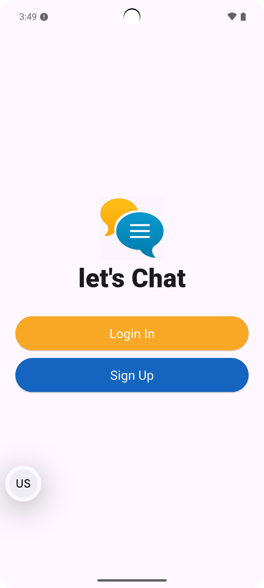
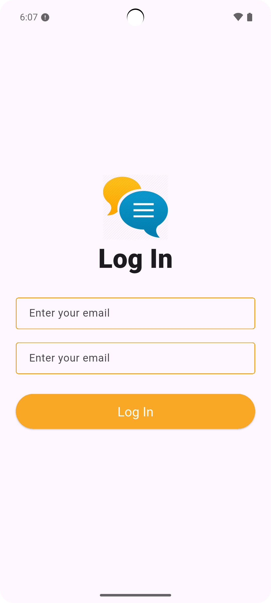
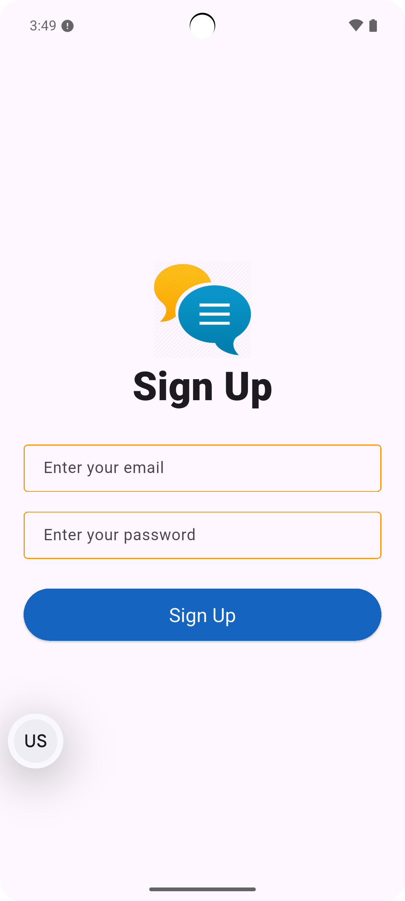
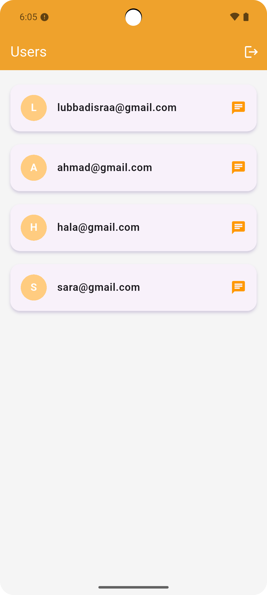
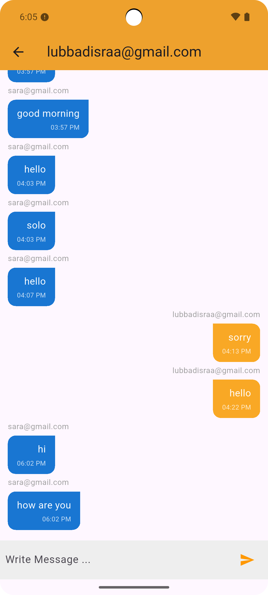
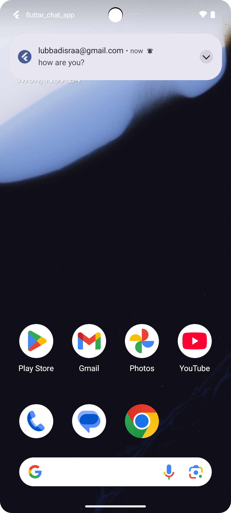
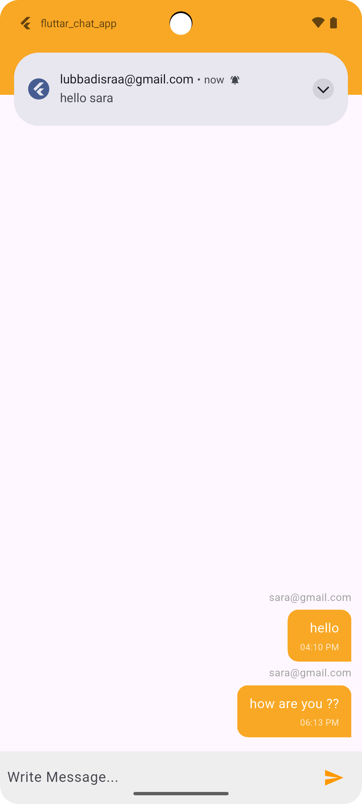

# 📱 Flutter Chat App

This is a simple and fast **chat application** built using Flutter and Firebase.  
It allows users to sign up, log in, view other users, and start real-time conversations — with notifications for every new message.

The app is perfect for:
- Anyone who wants to try a clean and easy chat app
- Developers who want to learn how to build a real chat system

---

## 🚀 Features

### 🔐 User Authentication
Create an account or log in using your email and password through Firebase Authentication.

### 👥 User List
See all registered users and choose anyone to start a conversation with.

### 💬 Private Messaging (1-to-1)
- Start chatting instantly with any user.
- Messages update **in real time** without refreshing.

### 🕒 Message Details
Each message shows:
- Sender email
- Timestamp

### 🔔 Push Notifications (FCM)
- Receive notifications even if the app is in the background or closed.
- Tapping the notification will take you directly to the correct chat screen.

### 📳 Local Notifications
If the app is open, you still get a local notification inside the app.

---

## 📥 Download the App

You can download the APK here:

👉 **Download APK:**  
🔗 [APK Download](https://drive.google.com/file/d/1BksWAYMW7EFvrQ_v0v7vqpWEUJYZgjc7/view?usp=sharing)

---

## 🖼️ Screenshots

  
  
  
  
  
  
  

## 📩 Contact

If you have any questions, feedback, or suggestions, feel free to reach out.  
Enjoy using the app! ❤️
